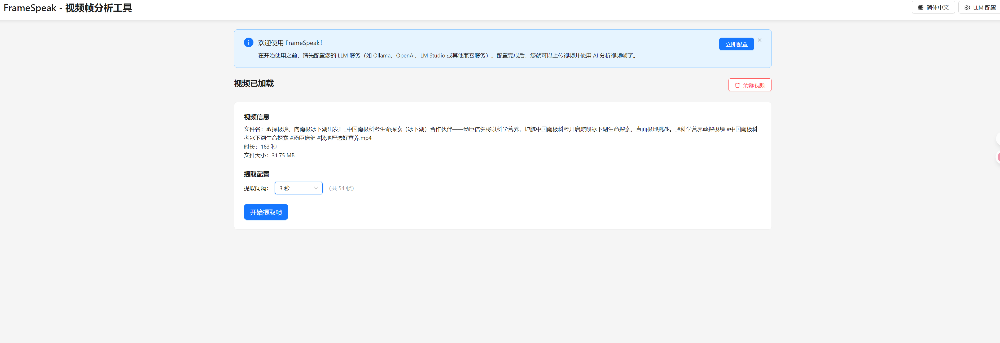
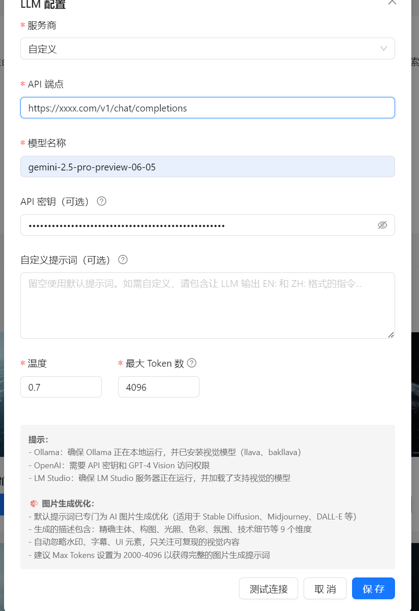
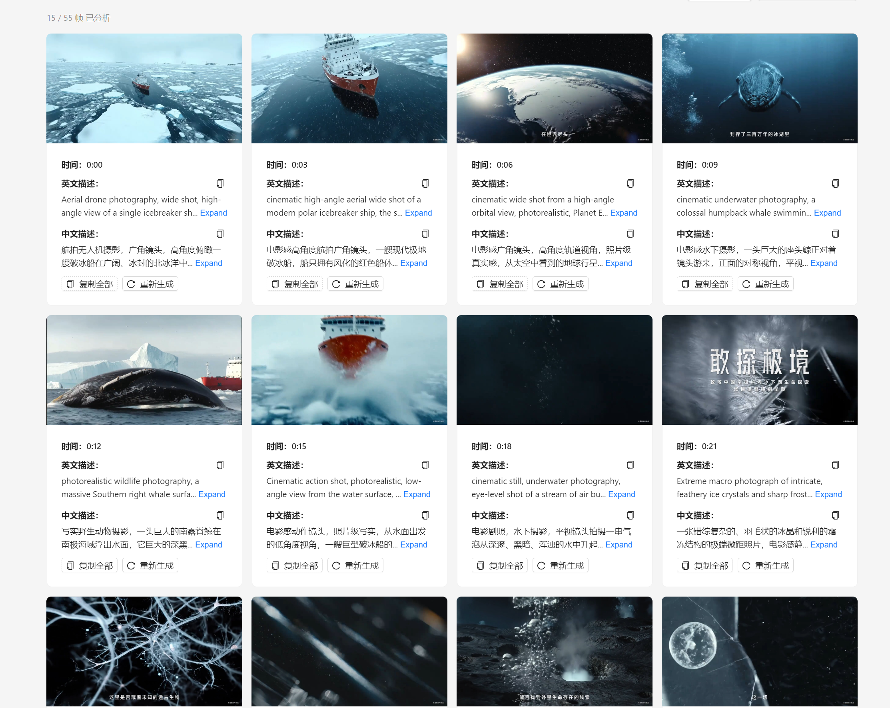

# FrameSpeak - AI 视频帧分析工具

FrameSpeak 是一款基于浏览器的视频分析应用，可以从视频中提取帧并使用本地 LLM 服务生成中英文双语描述。特别适用于为 AI 图片生成模型（如 Stable Diffusion、Midjourney、DALL-E）创建高质量提示词。

## 🌐 在线演示

访问在线版本：**[https://framespeak.333ai.de/](https://framespeak.333ai.de/)**


## ✨ 主要功能

- 📹 **视频上传**：支持拖拽或点击上传视频文件（MP4、AVI、MOV 等）
- 🎬 **帧提取**：可自定义提取间隔（3、5 或 10 秒）
- 🤖 **AI 分析**：使用本地 LLM 服务生成详细的图片描述
- 🌏 **双语输出**：同时生成英文和中文描述
- 💾 **本地存储**：所有配置和提取的帧都存储在浏览器本地
- ⚡ **批量处理**：支持一次性分析所有帧或逐个分析
- 🔌 **多 LLM 支持**：兼容 Ollama、OpenAI、LM Studio 和自定义端点

## ✨ 功能展示
上传视频


配置llm


分析


## 🛠️ 技术栈

- **前端**: React 19 + TypeScript
- **构建工具**: Vite
- **UI 库**: Ant Design
- **状态管理**: Zustand
- **存储**: IndexedDB（图片）+ localStorage（配置）
- **HTTP 客户端**: Axios
- **国际化**: i18next

## 📋 前置要求

- Node.js 18+ 和 npm
- 支持视觉能力的本地 LLM 服务：
  - **Ollama** 配合 llava 模型（推荐）
  - **LM Studio** 配合视觉模型
  - **OpenAI** API 或兼容接口

## 🚀 快速开始

### 安装

```bash
# 克隆仓库
git clone https://github.com/1433744303/FrameSpeak.git
cd FrameSpeak

# 安装依赖
npm install

# 启动开发服务器
npm run dev
```

应用将运行在 `http://localhost:5173`

### 配置 LLM 服务


#### 使用 OpenAI API

准备你的 OpenAI API 密钥（支持 GPT-4 Vision）

### 应用内配置

1. 点击页面右上角的 "LLM 配置" 按钮
2. 选择你的服务商（Ollama / OpenAI / LM Studio / 自定义）
3. 配置端点和模型名称
4. 点击"测试连接"以验证配置
5. 保存配置

## 📖 使用说明

1. **上传视频**: 拖拽视频文件到上传区域或点击选择
2. **提取帧**: 选择提取间隔（3/5/10 秒）并点击"提取帧"
3. **生成描述**:
   - 点击"批量分析所有帧"一次性处理所有帧
   - 或在每个帧卡片上点击"生成描述"单独处理
4. **复制结果**: 点击每个描述旁的复制按钮使用生成的提示词

## ⚙️ 配置选项

### LLM 设置

- **服务商**: Ollama、OpenAI、LM Studio 或自定义
- **API 端点**: LLM 服务的 URL
- **模型名称**: 要使用的模型（如 `llava`、`gpt-4-vision-preview`）
- **API 密钥**: OpenAI 或其他需要认证的服务
- **温度**: 控制输出的随机性（0.0 - 1.0）
- **最大 Token 数**: 生成描述的最大长度
- **自定义提示词**: 可选，自定义分析提示词模板

### 默认端点

- **Ollama**: `http://localhost:11434/api/chat`
- **OpenAI**: `https://api.openai.com/v1/chat/completions`
- **LM Studio**: `http://localhost:1234/v1/chat/completions`

## 🏗️ 构建和部署

```bash
# 构建生产版本
npm run build

# 预览生产构建
npm run preview

```

构建产物将输出到 `dist` 目录。

## 🎨 生成的描述格式

生成的描述针对 AI 图片生成模型进行了优化，包含：

- **主体细节**: 人物、物体的详细特征
- **动作与姿态**: 精确的动作、手势、表情
- **构图与取景**: 相机角度、镜头类型、构图规则
- **背景与环境**: 详细的场景描述
- **光照**: 光源类型、方向、质量
- **色彩**: 主色调、配色方案、色温
- **氛围**: 整体感觉、情绪、天气
- **艺术风格**: 摄影或艺术风格标签
- **技术细节**: 景深、纹理、材质属性

## 🔧 故障排除

### 无法连接到 LLM 服务

- 确保 LLM 服务正在运行
- 检查端点 URL 是否正确
- 验证防火墙设置
- 对于 Ollama，确认模型已下载：`ollama list`

### 描述质量不佳

- 尝试调整温度参数
- 增加最大 Token 数以获得更详细的描述
- 使用自定义提示词来引导输出格式
- 确保使用支持视觉的模型（如 llava、gpt-4-vision）


## 📄 许可证

本项目采用 MIT 许可证 - 查看 [LICENSE](LICENSE) 文件了解详情。


## 📮 反馈与支持

如有问题或建议，请[提交 Issue](https://github.com/1433744303/FrameSpeak/issues)。

---

使用 ❤️ 和 React 构建
